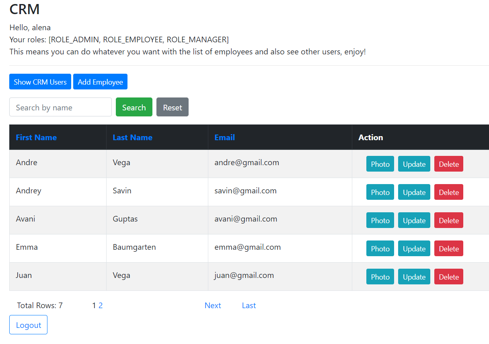

# mini-crm-project
Репозиторий содержит учебный проект. Это CRM система (учет работников), в которой есть пользователи с разными правами доступа (в зависимости от роли) и, соответственно, разным функционалом. 

## Функционал:
- добавление / обновление / удаление работников
- просмотр фото работника
- поиск по имени / фамилии
- сортировка по имени / фамилии / email
- просмотр списка всех пользователей crm с ролями (только для роли Admin)
- пагинация

## Stack
Spring Boot, Spring Data JPA, Spring Security, JUnit, Postgresql (Docker image), Thymeleaf, Maven

## Инструкции по запуску приложения
- Инициализация БД:
1. установить docker клиент
2. развернуть образ с базой данных командой ``` docker-compose up -d ``` из корня проекта
3. подключиться к БД любым клиентом, используя строку подключения: jdbc:postgresql://localhost:54320/postgres username/password: postgres
4. создать БД для нужд проекта командой в клиенте: ``` create database minicrm ```
5. подключиться к БД minicrm клиентом по адресу jdbc:postgresql://localhost:54320/minicrm username/password: postgres и выполнить команды из скрипта ``` home/sql-scripts/postgresInit.sql ``` 
Можно также сразу создать БД для интеграционных тестов: ``` create database minicrm_tests ```. Скрипт инициализации выполнять не требуется.

- Запуск приложения:  
Если на локальной машине установлен Maven: ``` mvnw spring-boot:run ```  
Если на локальной машине не установлен Maven: ``` mvn spring-boot:run ```

Приложение будет доступно по адресу ``` http://localhost:8888 ```

- Данные для входа:  
Admin: alena (пароль pass123)  
Manager: boris (пароль pass123)  
Employee: andrey (пароль pass123)

## Тестирование
В проекте реализовано интеграционное тестирование (контроллер, логин система) и модульное тестирование (методы сервисов).  
Команда для запуска тестов: ``` mvn clean test ``` или ``` mvnw clean test ```

## Так выглядит приложение


